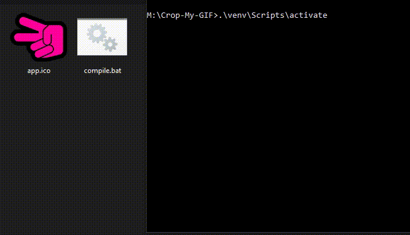

# Compiling the application

```{warning}
- First:  
**clone the repository and properly configure its virtualenv** ({doc}`cloning`)
- Second:  
**change to the directory and activate virtualenv** if it is not already activated:
```

    cd Crop-My-GIF
    .\venv\Scripts\activate

## Easy way

**Inside Crop-My-GIF virtualenv, change the directory to compile and run the script:**

    cd compile
    .\compile.bat
    


>> _**The folder containing the generated .exe file will be opened automatically**_

***

## Manual way

**Inside Easy-Gifer virtualenv, change the directory to compile folder and run pyinstaller:**

    cd compile
    pyinstaller -w --onefile ..\main.py --icon app.ico --name Crop-My-GIF --splash splashfile.jpg
    
>> _**The generated .exe file will be in .\compile\dist folder.**_

***

## requirements

    [requirements.txt]

    imageio==2.18.0
    imageio-ffmpeg==0.4.7
    moviepy==1.0.3
    Pillow==9.1.0
    pyinstaller==5.0.1
    pyinstaller-hooks-contrib==2022.4
    PySimpleGUI==4.59.0
    pywin32-ctypes==0.2.0
    screeninfo==0.8

```{include} <toctree.md>
```
